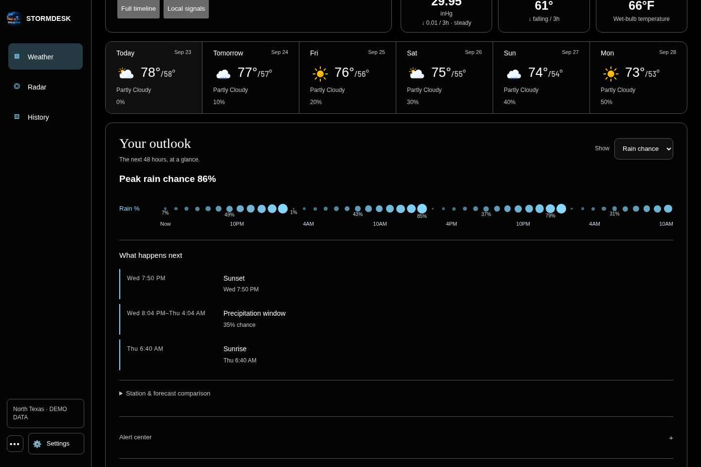
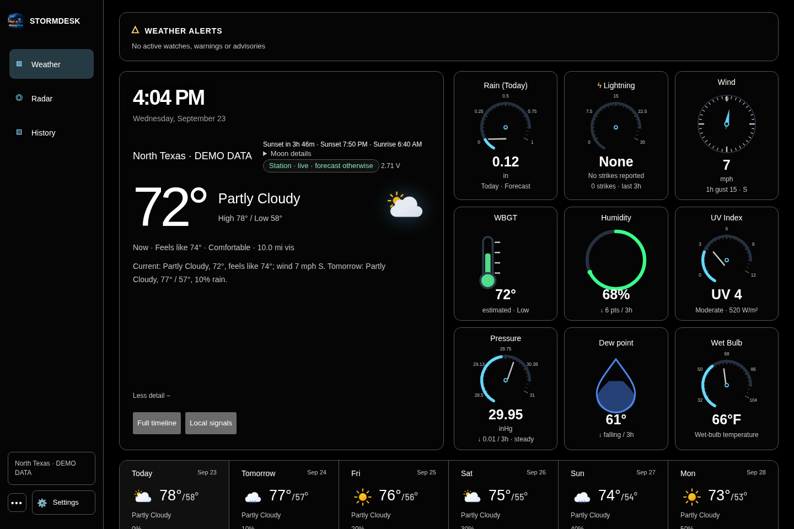
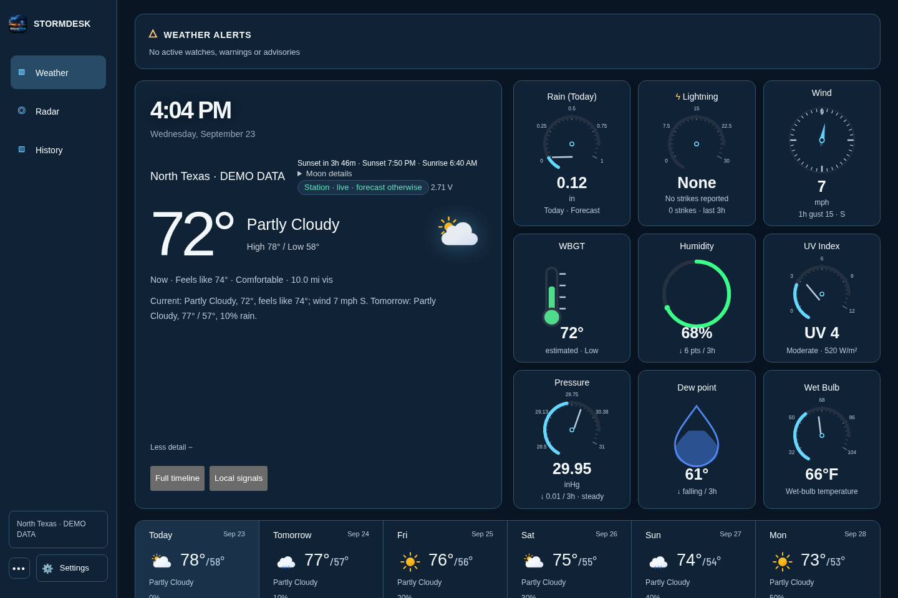
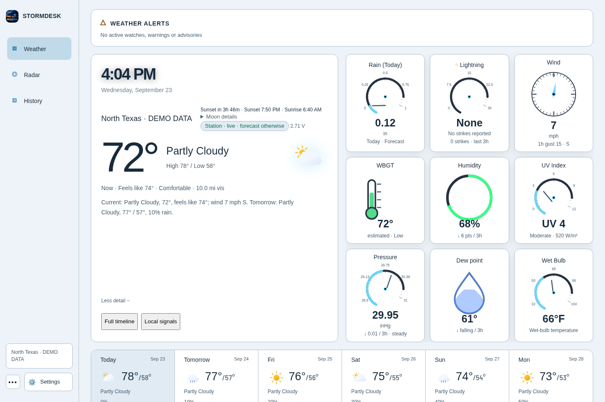
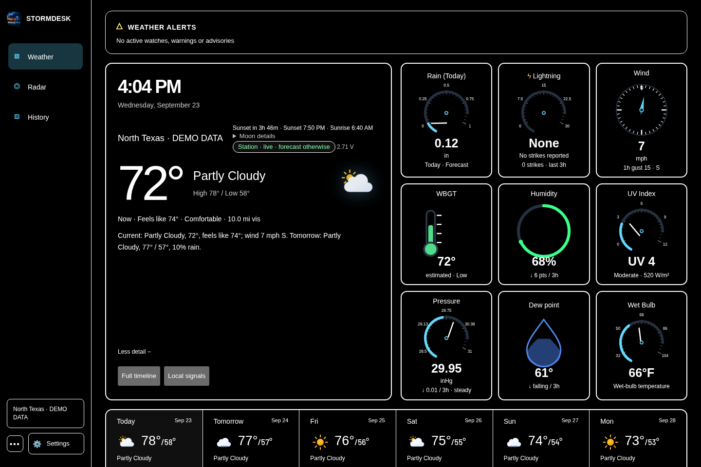
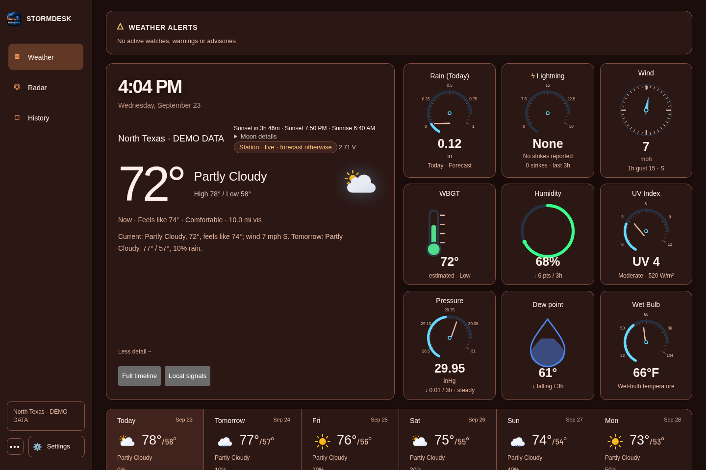

<p align="center"></p>

# StormDesk

**Your weather, at a glance.** StormDesk opens in OLED black with current conditions, nine fixed gauges, a six-day forecast, and a short “What happens next” summary. The gauges stay in their familiar order on desktop and tablet, so there is no layout to arrange or accidentally disturb.

Choose a location to start. A personal weather station is optional; readings that are unavailable stay visible and clearly labeled. StormDesk supports Tempest, Ecowitt, Ambient Weather, Davis, AcuRite, La Crosse, and other compatible sources.

The navigation has three destinations: **Weather**, **Radar**, and **History**. Radar gives HookEcho’s map the screen, with official warnings and emergencies along the bottom. History begins with clear temperature, rain, wind, and pressure snapshots and opens detailed charts on demand.

Choose **Settings → Appearance → Theme** to switch between OLED black, blue, light, high contrast, and orange & red. Each screen remembers its choice. No StormDesk account, subscription, or ads.

[Try StormDesk](https://app.mystormdesk.com/) · [Download](https://github.com/d4vid87/stormdesk/releases/latest) · [Website](https://mystormdesk.com/) · [Get help](https://github.com/d4vid87/stormdesk/issues)


The interface images show the current source with labeled demo station data. HookEcho supplies the radar map. Published installers may trail the browser build.

Stormdesk Lite remains available as a lighter browser interface for older devices: [open Lite](https://app.mystormdesk.com/lite/) or read its [design specification](design/stormdesk-lite/SPECIFICATION.md).

## Install StormDesk

Open the [latest release](https://github.com/d4vid87/stormdesk/releases/latest), then choose the
file for your device.

| Your device | File to choose | What to do |
|---|---|---|
| Windows 10 or 11 | `StormDesk_*_x64-setup.exe` | Open the file and follow the installer. Allow access on private networks when Windows asks. |
| Mac | `StormDesk_*_universal.dmg` | Open the file, then drag StormDesk into Applications. |
| Ubuntu, Debian, or Linux Mint | `StormDesk_*_amd64.deb` | Double-click the file, or use the short command below. |
| Other 64-bit Linux computers | `StormDesk_*_amd64.AppImage` | Make the file runnable, then open it. See the short command below. |
| Raspberry Pi 4 or 5 | `StormDesk_*_arm64.deb` | Use a 64-bit Raspberry Pi system, then install it with the short command below. |
| Android or Fire tablet | `StormDesk_v*.apk` | Open the file and allow installation from your browser or Files app when asked. |

If a Mac says it cannot verify StormDesk, open **System Settings → Privacy & Security** and choose
**Open Anyway**.

### Linux commands

For the optional **natural male voice** (Kokoro Michael), install [uv](https://docs.astral.sh/uv/),
then run `python3 scripts/install-natural-voice.py` from this repository. Setup downloads about
350 MB once; speech then runs locally on the CPU without an account or cloud service. An installed
`pw-play`, `paplay`, or `aplay` provides audio playback. Restart StormDesk and use **Enable / Test voice**;
the setting shows **Natural male voice · local** when ready. The ordinary system voice remains available
on installations without the voice pack. If an installed voice pack fails, the app reports the error
instead of silently changing back to the robotic voice.

Spoken watches and warnings: open **Settings → Basics → Sounds & notifications**, enable **Read warnings and watches aloud**,
then press **Enable / Test voice**. Keep the dashboard open. The status below the button explains
blocked playback or missing voices; the test does not send push notifications.

The Linux app falls back to the local `espeak-ng` engine when browser speech cannot start.
Debian and Arch packages install it as a dependency. AppImage users should install `espeak-ng`
with their package manager (for example, `sudo apt install espeak-ng` or `sudo pacman -S espeak-ng`).
Browser mode uses the browser's speech engine and may require a system voice and an initial tap.
On Linux, browser speech may also require `speech-dispatcher` and `espeak-ng`; restart the browser
after installing them. An embedded browser without speech support reports an error instead of
claiming an announcement played; use the Linux app's native fallback in that case.
Warnings and watches bypass quiet hours just as official alert notifications already do; routine
advisories stay silent. Closed-app and locked-phone announcements are not supported.

For Ubuntu, Debian, or Linux Mint:

```sh
sudo apt install ./StormDesk_*_amd64.deb
```

For a 64-bit Raspberry Pi:

```sh
sudo apt install ./StormDesk_*_arm64.deb
```

For the AppImage:

```sh
chmod +x StormDesk_*_amd64.AppImage
./StormDesk_*_amd64.AppImage
```

To build a local AppImage from source, run `bash scripts/build-appimage.sh` with Docker
running. It builds in Ubuntu 22.04, matching the release workflow and avoiding Arch's
newer GTK loader layout and incompatible bundled strip tool. The unsigned preview is
written to `src-tauri/target/appimage-ubuntu/release/bundle/appimage/`. Build caches stay
under `~/.cache/stormdesk-appimage`; no host packages are changed. Published, signed
updater artifacts still come from the GitHub release workflow.

If the AppImage opens a blank window, use browser mode:

```sh
./StormDesk_*_amd64.AppImage --browser
```

### Chromebook

The easiest option is to run StormDesk on another computer in your home, then open the address
shown by StormDesk in the Chromebook browser. If Linux is enabled on your Chromebook, you can also
download the AppImage and run it with `--browser`.

## Set it up

1. Open StormDesk and search for your town or postcode.
2. Choose the matching location to see current conditions and the forecast.
3. If you have a personal station, connect it under **Settings → Basics → Station connection**.

The nine gauges are preloaded in a fixed arrangement. Station readings appear where available;
forecast estimates fill the remaining weather information.

Tempest owners need a personal-use token from **tempestwx.com → Settings → Data Authorizations**.
StormDesk can find the stations connected to that token, so you do not need to hunt for sensor
numbers.

Other supported stations send readings directly from your home network. StormDesk shows the exact
address to enter in your station's app or console.

Don't own a weather station? Choosing a location is enough to use the forecast dashboard.

## Use it around your home

The desktop app shows an address such as `http://192.168.1.20:8088` in its window title. Open that
address on another device connected to the same Wi-Fi. Leave StormDesk running on the main
computer so the other screens can reach it.

Use the address ending in `/public` for a read-only screen that cannot change settings.

## What you get

- **Weather** — current conditions, nine fixed gauges, the forecast, and what happens next.
- **Radar** — live HookEcho radar with warnings and playback.
- **History** — charts, records, model comparisons, rain totals, and your weather archive.
- **More weather detail** — the full timeline and local signals remain accessible from Weather.
- **Alerts** — built-in warnings plus your own rules for wind, rain, heat, cold, and more.
- **Backup** — one complete backup file for your settings and weather history.

## On smaller screens

The same Weather and Radar pages adapt to phone-sized screens. The desktop and tablet gauge arrangement remains fixed; on a phone the gauges keep their order and flow down the page.

 

## Screenshots

| Weather | Radar | History |
| --- | --- | --- |
|  |  |  |



<details><summary>Explore all five themes</summary>

| OLED black (default) | Blue | Light |
| --- | --- | --- |
|  |  |  |

| High contrast | Orange & red |
| --- | --- |
|  |  |

</details>

<details><summary>Settings and phone layouts</summary>


 

</details>

## Supported weather stations

- WeatherFlow Tempest
- Ecowitt and Wittboy
- Ambient Weather
- Davis WeatherLink Live
- AcuRite through `rtl_433`
- La Crosse Technology
- WeeWX
- Many stations that can send data in Weather Underground format
- Forecast-only mode when no station is available

Brand-by-brand instructions are in the
[technical guide](docs/technical-reference.md#other-weather-stations).

## Need help?

Open **Settings → Advanced → Diagnostics** or the **Health Center**. StormDesk checks your station, forecast,
alerts, radar, saved history, and other connections. **Copy support report** creates a safe report
you can paste into a GitHub issue without including passwords, tokens, or your location.

Common fixes:

- **No readings:** reopen the welcome setup and make sure it receives one real reading.
- **Another screen cannot connect:** keep StormDesk running and allow it through the main computer's firewall on private networks.
- **Blank Linux window:** start StormDesk with `--browser`.
- **Old or missing forecast:** open the Health Center and choose **Retry now**.

If you are still stuck, [report a problem](https://github.com/d4vid87/stormdesk/issues/new) and
include the support report.

## For technical users

The [technical guide](docs/technical-reference.md) covers Docker, Home Assistant, MQTT, alert
services, read-only sharing, station upload formats, building from source, data sources, testing,
and troubleshooting.

- [Home Assistant guide](docs/homeassistant.md)
- [WeeWX guide](docs/weewx.md)
- [Security policy](SECURITY.md)
- [Changes in each release](CHANGELOG.md)

## Privacy

StormDesk stores its settings and weather history on your own computer. It has no user accounts,
ads, or app tracking. Forecast and alert providers receive only the information needed to return
weather for your area.

The regular home-network dashboard is meant for people you trust. Use `/public` for guests or any
screen that should not see or change private settings.

## License

StormDesk is free and open source under the [MIT License](LICENSE).
