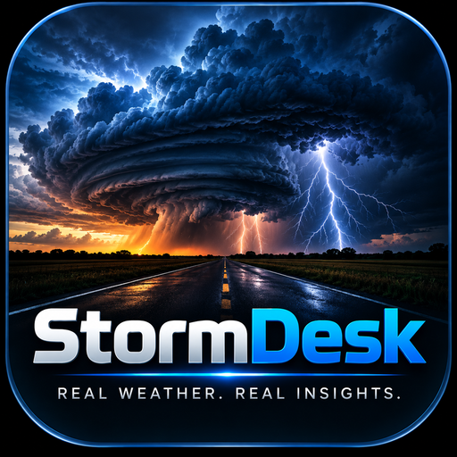
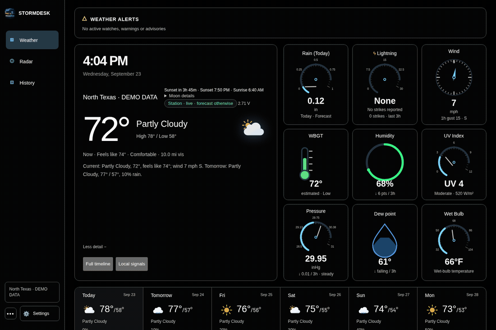
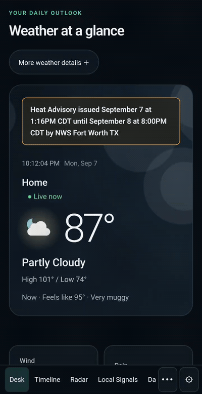
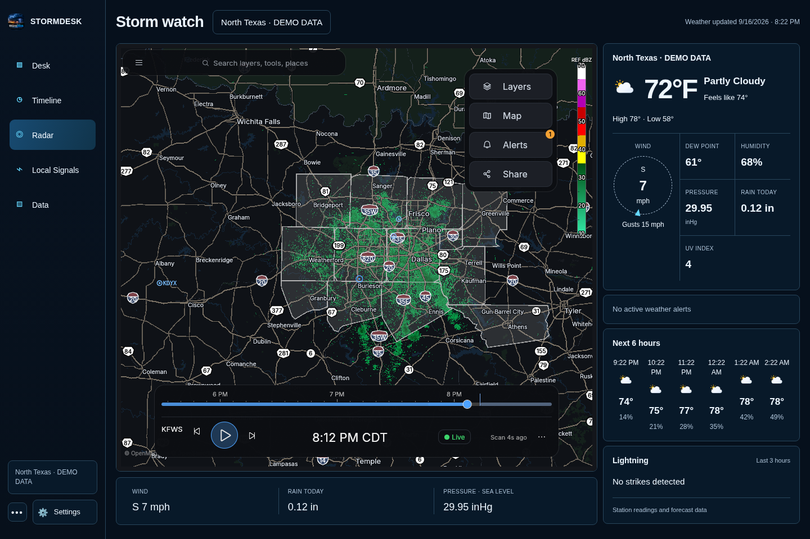
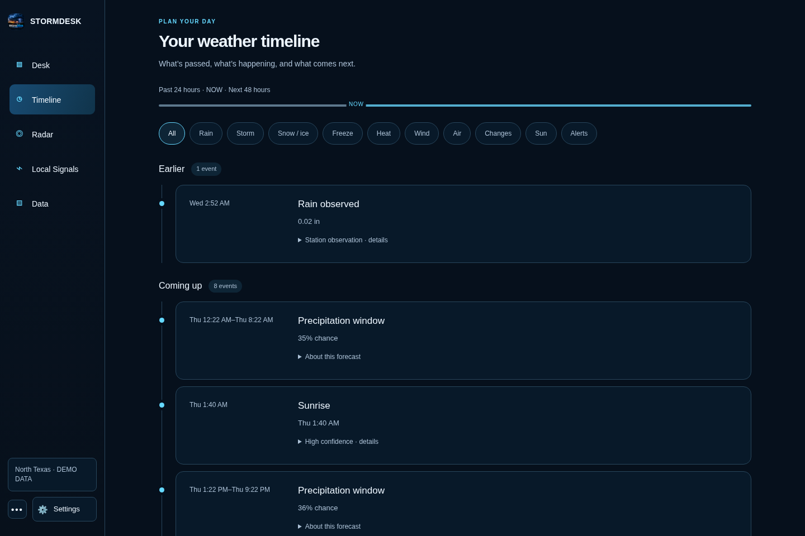
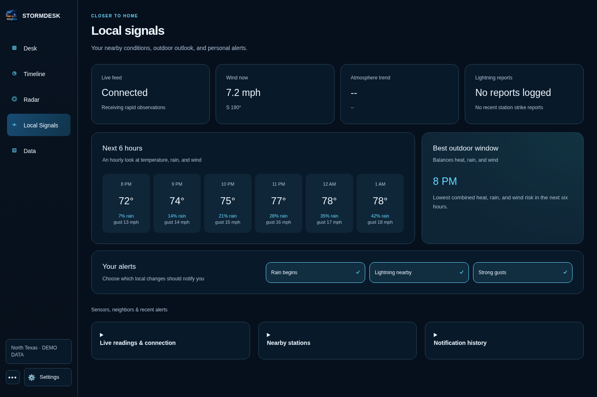
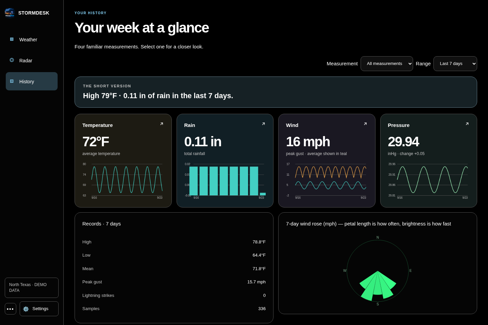
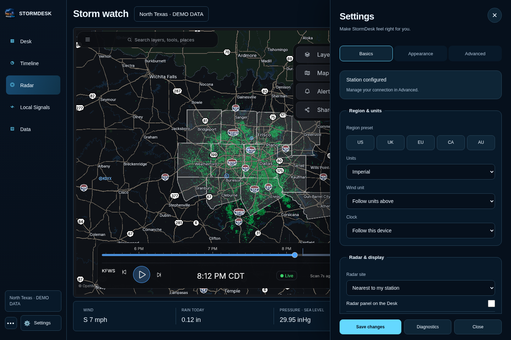
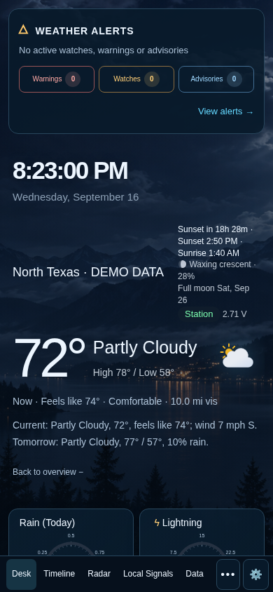
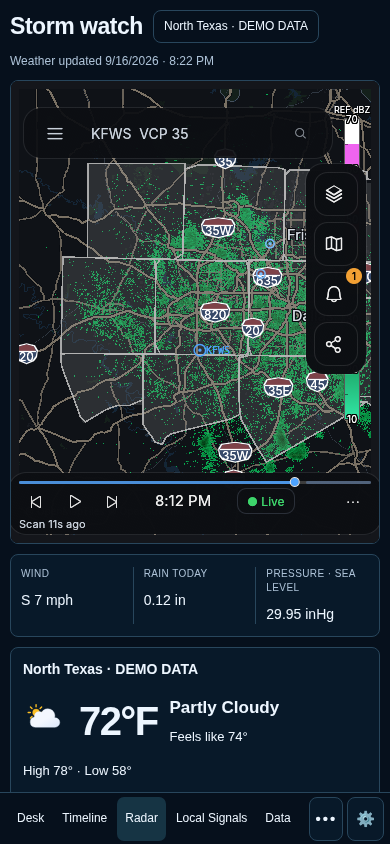

<p align="center"></p>

# StormDesk

**Your weather station, made clear.**

StormDesk brings your current weather, forecast, alerts, radar, and history together on one clean
screen. Use it on a computer, wall tablet, phone, or another screen in your home.

It works with Tempest, Ecowitt, Ambient Weather, Davis, AcuRite, La Crosse, and many other personal
weather stations. You can also use StormDesk without a weather station.

No StormDesk account. No subscription. No ads.

[Download StormDesk](https://github.com/d4vid87/stormdesk/releases/latest) ·
[Visit the website](https://hookecho.io/stormdesk/) ·
[Get help](https://github.com/d4vid87/stormdesk/issues)



Interface preview from the current source. Station readings in these images are labeled demo data;
radar comes from HookEcho. Downloaded releases may precede this redesign.

## Install StormDesk

Open the [latest release](https://github.com/d4vid87/stormdesk/releases/latest), then choose the
file for your device.

| Your device | File to choose | What to do |
|---|---|---|
| Windows 10 or 11 | `StormDesk_*_x64-setup.exe` | Open the file and follow the installer. Allow access on private networks when Windows asks. |
| Mac | `StormDesk_*_universal.dmg` | Open the file, then drag StormDesk into Applications. |
| Ubuntu, Debian, or Linux Mint | `StormDesk_*_amd64.deb` | Double-click the file, or use the short command below. |
| Other 64-bit Linux computers | `StormDesk_*_amd64.AppImage` | Make the file runnable, then open it. See the short command below. |
| Raspberry Pi 4 or 5 | `StormDesk_*_arm64.deb` | Use a 64-bit Raspberry Pi system, then install it with the short command below. |
| Android or Fire tablet | `StormDesk_v*.apk` | Open the file and allow installation from your browser or Files app when asked. |

If a Mac says it cannot verify StormDesk, open **System Settings → Privacy & Security** and choose
**Open Anyway**.

### Linux commands

Spoken watches and warnings: open **Settings → Basics → Sounds & notifications**, enable **Read warnings and watches aloud**,
then press **Enable / Test voice**. Keep the dashboard open. The status below the button explains
blocked playback or missing voices; the test does not send push notifications.

The Linux app falls back to the local `espeak-ng` engine when browser speech cannot start.
Debian and Arch packages install it as a dependency. AppImage users should install `espeak-ng`
with their package manager (for example, `sudo apt install espeak-ng` or `sudo pacman -S espeak-ng`).
Browser mode uses the browser's speech engine and may require a system voice and an initial tap.
On Linux, browser speech may also require `speech-dispatcher` and `espeak-ng`; restart the browser
after installing them. An embedded browser without speech support reports an error instead of
claiming an announcement played; use the Linux app's native fallback in that case.
Warnings and watches bypass quiet hours just as official alert notifications already do; routine
advisories stay silent. Closed-app and locked-phone announcements are not supported.

For Ubuntu, Debian, or Linux Mint:

```sh
sudo apt install ./StormDesk_*_amd64.deb
```

For a 64-bit Raspberry Pi:

```sh
sudo apt install ./StormDesk_*_arm64.deb
```

For the AppImage:

```sh
chmod +x StormDesk_*_amd64.AppImage
./StormDesk_*_amd64.AppImage
```

If the AppImage opens a blank window, use browser mode:

```sh
./StormDesk_*_amd64.AppImage --browser
```

### Chromebook

The easiest option is to run StormDesk on another computer in your home, then open the address
shown by StormDesk in the Chromebook browser. If Linux is enabled on your Chromebook, you can also
download the AppImage and run it with `--browser`.

## Set it up

1. Open StormDesk.
2. On the welcome screen, choose your weather-station brand.
3. Follow the instructions shown for that brand.
4. StormDesk checks for a real reading and a working forecast before setup finishes.

Tempest owners need a personal-use token from **tempestwx.com → Settings → Data Authorizations**.
StormDesk can find the stations connected to that token, so you do not need to hunt for sensor
numbers.

Other supported stations send readings directly from your home network. StormDesk shows the exact
address to enter in your station's app or console.

Don't own a weather station? Choose **Skip — just show me the weather somewhere**, then search for
your town or postcode.

## Use it around your home

The desktop app shows an address such as `http://192.168.1.20:8088` in its window title. Open that
address on another device connected to the same Wi-Fi. Leave StormDesk running on the main
computer so the other screens can reach it.

Use the address ending in `/public` for a read-only screen that cannot change settings.

## What you get

- **Desk** — the weather now, a plain-language summary, the next few days, and the details you care about.
- **Timeline** — what happened during the past day and what is expected during the next two days.
- **Radar** — live HookEcho radar with warnings and playback.
- **Local Signals** — fast wind updates, nearby sensors, lightning, and recent alerts.
- **Data** — charts, records, model comparisons, rain totals, and your weather archive.
- **Alerts** — built-in warnings plus your own rules for wind, rain, heat, cold, and more.
- **Backup** — one complete backup file for your settings and weather history.

## On Android



Recorded on a Samsung Galaxy S24 Ultra. [Watch both phone demos](https://hookecho.io/#android).

## Screenshots


| Storm watch | Weather timeline |
| --- | --- |
|  |  |

| Local signals | Weather history |
| --- | --- |
|  |  |

<details><summary>Settings and phone layouts</summary>



 

</details>

## Supported weather stations

- WeatherFlow Tempest
- Ecowitt and Wittboy
- Ambient Weather
- Davis WeatherLink Live
- AcuRite through `rtl_433`
- La Crosse Technology
- WeeWX
- Many stations that can send data in Weather Underground format
- Forecast-only mode when no station is available

Brand-by-brand instructions are in the
[technical guide](docs/technical-reference.md#other-weather-stations).

## Need help?

Open **Settings → Diagnostics** or the **Health Center**. StormDesk checks your station, forecast,
alerts, radar, saved history, and other connections. **Copy support report** creates a safe report
you can paste into a GitHub issue without including passwords, tokens, or your location.

Common fixes:

- **No readings:** reopen the welcome setup and make sure it receives one real reading.
- **Another screen cannot connect:** keep StormDesk running and allow it through the main computer's firewall on private networks.
- **Blank Linux window:** start StormDesk with `--browser`.
- **Old or missing forecast:** open the Health Center and choose **Retry now**.

If you are still stuck, [report a problem](https://github.com/d4vid87/stormdesk/issues/new) and
include the support report.

## For technical users

The [technical guide](docs/technical-reference.md) covers Docker, Home Assistant, MQTT, alert
services, read-only sharing, station upload formats, building from source, data sources, testing,
and troubleshooting.

- [Home Assistant guide](docs/homeassistant.md)
- [WeeWX guide](docs/weewx.md)
- [Security policy](SECURITY.md)
- [Changes in each release](CHANGELOG.md)

## Privacy

StormDesk stores its settings and weather history on your own computer. It has no user accounts,
ads, or app tracking. Forecast and alert providers receive only the information needed to return
weather for your area.

The regular home-network dashboard is meant for people you trust. Use `/public` for guests or any
screen that should not see or change private settings.

## License

StormDesk is free and open source under the [MIT License](LICENSE).
